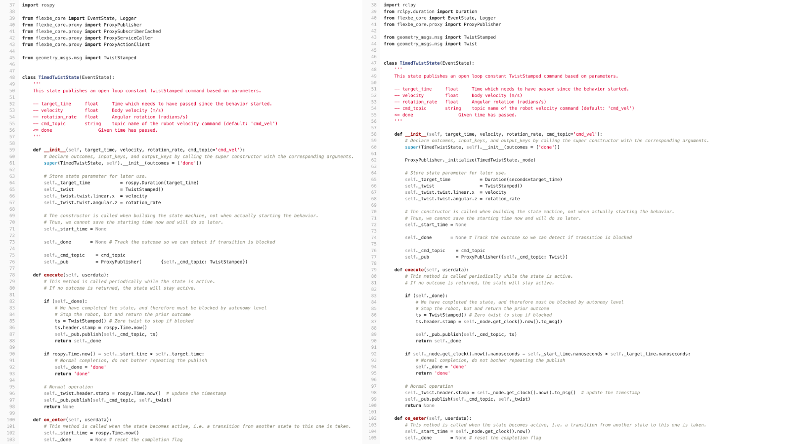

# Notes on converting existing FlexBE State Implementations to ROS 2

Most changes to custom FlexBE states from ROS 1 to ROS 2 are very minimal due to
FlexBE’s proxies and built-in State classes handling most of the processes for
the custom states behind the scenes. As a result, the biggest changes to custom
FlexBE states focus on configuring the FlexBE proxies as well as handle any
direct calls to ROS 1’s rospy package.

The following image shows the ROS 1 (left) and ROS 2 (right) versions of the `TimedTwistState` from [Flexible Navigation](https://github.com/flexbe/flexible_navigation.git), a FlexBE-based navigation system.

As can be seen in the ROS 2 version's constructor, the `ProxyPublisher` used to create a publisher to publish `TwistStamped` messages first needs to be initialized using the `TimedTwistState`'s node.
This would also be done with a `ProxySubscriberCached`, `ProxyActionClient`, and `ProxyServiceCaller` to create a subscriber, action client, and service client respectively.
After initializing, the creation of the proxy publisher, subscriber, action client,
and service client is done like in ROS 1.
In addition, all of the prior proxy function calls in ROS 1 are supported in ROS 2.
Due to this, it is encouraged to use the FlexBE proxies as most of the changes
between ROS 1 and ROS 2 are hidden.

With this in mind, the only remaining changes involve direct calls to the `rospy` package.
As shown in the respective ROS 1 and ROS 2 code, they use `rospy` and the
`TimedTwistState`’s node to set the timestamp of a header message.
When setting the timestamp, the ROS 2 version is able to use `self._node` as
opposed to `TimedTwistStamped._node` in the constructor.
The reason is that during the creation of the custom state in the constructor
the individual instance of the custom state does not have access to the node.
However, during execution the custom state instance has access to its node,  
where the `TimedTwistState` can use its node to get the current time.
Like getting the time for the timestamp, each instance of directly using the
`rospy` package needs to be changed to use the custom state’s node.

Consult the ROS 2 documentation for more information on using the ROS 2 API.
