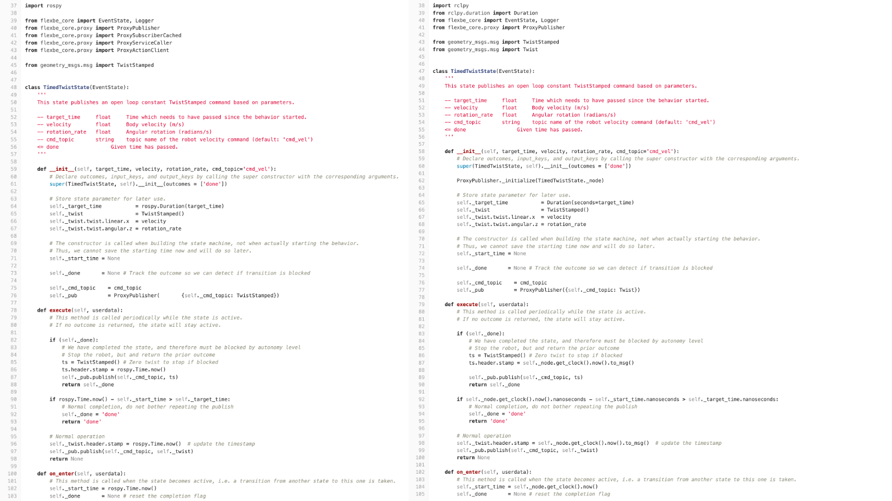

# Notes on converting existing FlexBE State Implementations to ROS 2

Most changes to custom FlexBE states from ROS 1 to ROS 2 are very minimal due to
FlexBE’s proxies and built-in State classes handling most of the processes for
the custom states behind the scenes. As a result, the biggest changes to custom
FlexBE states focus on configuring the FlexBE proxies as well as handle any
direct calls to ROS 1’s rospy package.

The following image shows the ROS 1 (left) and an early version of the ROS 2 (right) conversion of the
[`TimedTwistState`](https://github.com/FlexBE/flexible_navigation/blob/ros2-devel/flex_nav_flexbe_states/flex_nav_flexbe_states/timed_twist_state.py)
from [Flexible Navigation](https://github.com/flexbe/flexible_navigation.git), a FlexBE-based navigation system.

> Note: the call to `ProxyPublisher.initialize(TimedTwistState._node)` shown in the image is no longer required; see [`TimedTwistState`](https://github.com/FlexBE/flexible_navigation/blob/ros2-devel/flex_nav_flexbe_states/flex_nav_flexbe_states/timed_twist_state.py) for the latest code.
As of version `3.1.0`, these calls within individual states can be avoided by making a single call to `initialize_flexbe_core` in
the behavior initialization; that is, `initialize` is no longer required at the state implementation level.
The `flexbe_webui` writes behaviors with this call.
Older behaviors should be updated to make this call, or ensure states are
properly initialized by calling `initialize_flexbe_core(node)` in the behavior's `__init__`. New states do not require per-proxy `initialize()` calls if the proxies are initialized by the behavior using `initialize_flexbe_core`.

As can be seen in the ROS 2 version's constructor, a `ProxyPublisher` is created to publish `TwistStamped` messages.
The same approach applies to `ProxySubscriberCached`, `ProxyActionClient`, and `ProxyServiceCaller` for subscribers, action clients, and service clients respectively.
Note that the explicit `initialize()` call shown in the image is no longer needed; proxy instances can be created directly in `__init__` once `initialize_flexbe_core(node)` has been called in the behavior.
The creation and use of proxy publisher, subscriber, action client,
and service client is otherwise the same as in ROS 1.
In addition, all of the prior proxy function calls in ROS 1 are supported in ROS 2.
Due to this, it is encouraged to use the FlexBE proxies as most of the changes
between ROS 1 and ROS 2 are hidden.

With this in mind, the only remaining changes involve direct calls to the `rospy` package.
As shown in the respective ROS 1 and ROS 2 code, they use `rospy` and the
`TimedTwistState`’s node to set the timestamp of a header message.
When setting the timestamp, the ROS 2 version uses `TimedTwistState._node`
(a class-level attribute shared across all state instances, set during behavior startup).
The node is not available as `self._node` during `__init__` because proxy initialization
has not yet occurred at construction time.
However, during execution (`execute()`, `on_enter()`, `on_exit()`, etc.) the class-level
node is available and `TimedTwistState._node` can be used to get the current time.
Like getting the time for the timestamp, each instance of directly using the
`rospy` package needs to be changed to use the class-level node reference.

Consult the ROS 2 documentation for more information on using the ROS 2 API.
